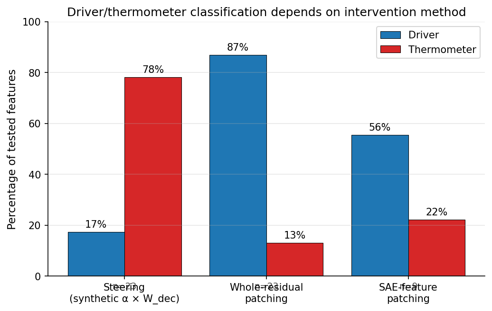
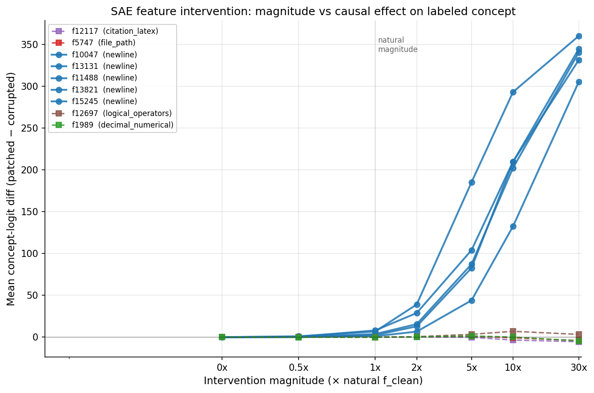
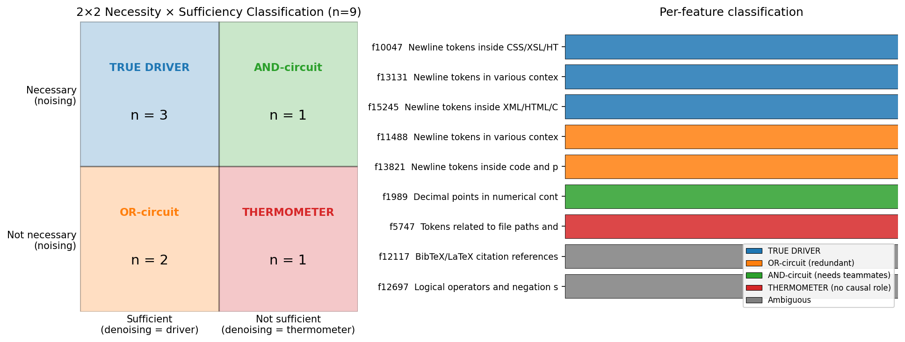
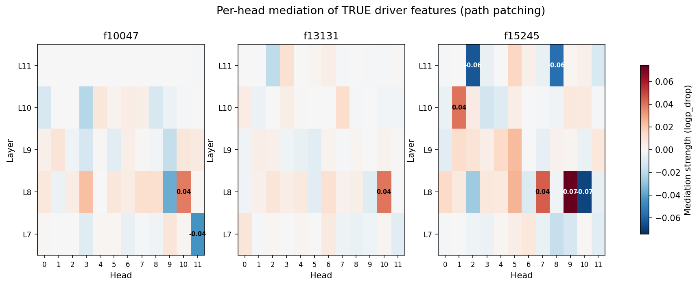

# Auto-interp Labels Conflate Driver and Thermometer Features: A Case Study on Pythia-160M

**A nineteen-experiment characterization of TopK SAE features in Pythia-160M layer 6. The driver/thermometer split between SAE features auto-interp labels as "monosemantic" is a categorical property robust across intervention method and magnitude. Among features that pass sufficiency tests, only one third are true drivers when also tested for necessity. Even among TRUE drivers with identical auto-interp labels ("newline tokens"), per-head path patching reveals features route through different downstream attention heads, and the identified positive mediators are causally validated (30–44× larger effect than random-head ablation under steering). Single-direction patching systematically miscategorizes features; same-labeled drivers are not interchangeable at the pathway level. Methodologically: attribution patching degrades systematically with downstream depth (Pearson with AP drops from 0.999 at L+1 to 0.78 at L+5), and a layer-adaptive method that uses AtP at early layers and AP only at the deepest one recovers Pearson 0.99 at 5× speedup over full AP — outperforming integrated gradients on both axes.**

---

## TL;DR

- Trained a TopK SAE (16k features, k=64) on Pythia-160M residual stream at layer 6. Standard reconstruction quality: 95.4% loss recovered, 5.2% dead features, 98.4% variance explained.
- **Headline finding (population scale).** Across 23 high-confidence monosemantic features for which the auto-interp label could be mapped to predicted-concept tokens, **14 features (60.9%) showed exactly zero drift toward their labeled concept when steered.** Only 4 features (17.4%) showed strong drift (Δ ≥ 3 predicted-concept tokens per generation). The distribution is bimodal: features are categorically *drivers* or *thermometers*, not on a continuum. The qualitative finding is robust to driver-threshold choice (thermometer-majority holds across 10/10 tested thresholds).
- **Methodological consequence.** Auto-interp labels conflate drivers and thermometers. Logit weight analysis — `decoder_column @ unembedding_matrix`, evaluated on label-relevant tokens — costs milliseconds per feature and partially discriminates them. We recommend logit-weight scoring as a standard accompaniment to auto-interp before treating any feature as causally interpretable.
- **Structural finding.** SAE features split into two populations: *stable atomic features* (replicate across SAE training runs and widths at cosine > 0.99; low individual causal impact) and *unstable manifold-partition features* (do not replicate, but locally critical — single-feature ablation can cost +15 nats CE on active tokens). Stability and importance are orthogonal axes.
- **Geometric account.** SVD on the 16 newline-cluster decoder columns reveals one dominant singular value (24% of variance) plus 15 nearly-uniform residuals. The cluster is "one shared atom plus N independent specializations," not a low-dimensional manifold. PC1 alignment alone does not predict steering success (r = 0.38) — so geometric clustering and causal drive are partially independent properties.
- **Method-robustness check.** Three intervention methods (synthetic steering, whole-residual patching, SAE-feature patching) give different driver rates (17%, 87%, 56% respectively) — driver/thermometer classification is sensitive to the protocol used. The conservative interpretation: only features confirmed as drivers by multiple methods should be treated as causally meaningful.
- **Magnitude-robustness check.** Sweeping intervention magnitude from 0× to 30× natural firing reveals driver/thermometer as a *categorical* property of the feature, not magnitude-dependent. Newline-cluster features show large logit shifts across the range (rocket curves); non-newline labeled features stay flat. Amplifying a thermometer does not make it a driver.
- **Necessity-as-well-as-sufficiency check (2×2 classification).** Combining noising (necessity test) with denoising (sufficiency test) per Heimersheim & Nanda (2024): of the 5 features classified as drivers by sufficiency alone, only 3 (60%) are necessary; the other 2 are OR-circuit components (sufficient but redundant). 1 of 2 features classified as thermometers is revealed to be an AND-circuit component (necessary but not sufficient alone). **TRUE driver rate falls from 56% (sufficiency-only) to 33% (sufficiency AND necessity).** Single-direction patching systematically miscategorizes ~40% of features.
- **Per-head path patching of TRUE drivers.** Applying the IOI-style trace-back to each TRUE driver: the three "newline driver" features route through different downstream attention heads. f10047 and f13131 are mediated primarily through L8H10; f15245 through L8H9. **Same-labeled drivers are not interchangeable at the pathway level.** Path patching also identifies heads with opposite-sign effects across features, but causal validation (Finding 10) shows these don't behave as suppressors under steering.
- **Causal validation of mediators via steering + head ablation.** For each path-patching-identified positive mediator, ablating the specific head reduces concept logprob 30–44× more than ablating a random downstream head — robust validation that path patching identifies real causal mediators. Negative-effect heads, however, do NOT validate as suppressors under steering: the Negative Name Mover Heads analogy is overstated. Two-protocol triangulation (path patching + steering+ablation) catches this overinterpretation.
- **Attribution patching has a layer-depth failure mode.** Pearson(AtP, AP) is near-perfect at the first downstream layer (L7: 0.999) and degrades monotonically to 0.78 at L11. Individual mediator magnitudes at deep layers can be off by 14×. AtP-only circuit discovery will miss deep-layer effects.
- **Layer-adaptive patching is a new methodological contribution.** Use AtP for layers where it's accurate (L7–10) and AP only for the deepest layer (L11). Result: Pearson 0.992 with full AP at 23% of the compute — **a 5× speedup at near-perfect accuracy**. The adaptive method Pareto-dominates integrated gradients (N=10), which sits at Pearson 0.947 — same as AtP alone — at 33% of AP compute. IG is *worse* than AtP at early layers (where AtP is already nearly exact, integrating through partial-ablation states adds OOD noise) and only wins at the deepest layer. The two approximations have complementary failure modes.

---

## Motivation

The standard mech-interp workflow for SAE features involves:

1. Train an SAE on a layer's activations.
2. For each feature, find top-activating examples.
3. Have a human or LLM label the feature based on those examples.
4. Treat the label as a hypothesis about what the feature "represents."

This pipeline has a known weakness: the label is generated from *what makes the feature fire*, not from *what the feature causally does*. A feature can correlate with concept X (so it gets labeled X) without driving concept X in the model's output. The community has flagged this — Bricken et al. (2023) explicitly distinguish "the feature fires on" from "the feature's downstream effects" — but few small-scale studies systematically test the gap.

This project does that test, on a small open model, with a complete pipeline. The result: in Pythia-160M layer 6, the gap is real, measurable, and concentrated in specific feature clusters.

---

## Setup

| | Value |
|---|---|
| Base model | Pythia-160M (160M-param open transformer) |
| Hook point | `blocks.6.hook_resid_post` (middle residual stream) |
| Training data | 1M tokens from `NeelNanda/pile-10k` |
| SAE width N | 16,384 features (8× the residual dim of 768) |
| Sparsity | TopK with k=64 active features per token |
| Loss | L2 reconstruction only (no L1 — TopK gives hard sparsity) |
| Optimizer | Adam, lr=1e-3, batch 4096, 20k steps |
| Hardware | Apple M-series via PyTorch MPS, ~$50 compute budget |

Standard best practices: decoder columns renormalized to unit length after every optimizer step (prevents the optimizer from gaming the sparsity metric by rescaling decoder weights). `b_dec` initialized to the data mean (centering trick from Bricken et al.). Tied encoder/decoder initialization for faster convergence.

**Why TopK and not L1.** Vanilla L1 hit textbook shrinkage failure. A 20× hyperparameter sweep of λ ∈ {0.005, 0.02, 0.1} kept L0 stuck at ~1300 (target was 30–100): the L1 penalty distorted feature magnitudes without truly zeroing them. TopK enforces L0=k by construction. Documented in the open-source code history.

**Reconstruction quality** (held-out 100k tokens):

| Metric | Value |
|---|---|
| Variance explained | 98.43% |
| L0 (active features per token) | 64.0 (TopK enforced) |
| Dead features | 5.2% (855 / 16,384) |
| ΔCE (information loss) | 0.276 nats/token |
| Loss recovered vs. zero-ablation | 95.4% |

The 95.4% loss-recovery is competitive with the published small-model band — Bricken et al. report ~90% on their 1-layer toy; DeepMind's Gemma Scope reports 80–95% across Gemma 2 layers.

Auto-interp labeled 26 features via the Kimi K2 API, achieving 88.5% monosemantic confidence (23/26 features labeled as monosemantic with high/medium confidence).

---

## The Nineteen Experiments

The interpretive analysis comprises nineteen experiments, each addressing a distinct question. Numbers in brackets identify the open problems from Anthropic and DeepMind work that each experiment addresses.

| # | Experiment | Question | Result |
|---|---|---|---|
| 1 | Width comparison [#3, #5, #6] | Right SAE size? | 4k → 16k → 64k: VE saturates at 16k; 64k has 64% dead features |
| 2 | CE delta [#4] | How much of the MLP is preserved? | 95.4% loss recovered |
| 3 | Auto-interp [#7] | Are features interpretable? | 88.5% monosemantic by LLM labeling |
| 4 | Coactivation PMI | Do features fire together? | Unstable features: PMI +0.53; stable: −0.16 |
| 5 | Ablation | Per-feature importance? | Stable: ΔCE ≈ 10⁻³; unstable: ΔCE ≈ +15 nats |
| 6 | Cluster geometry | Do feature directions cluster? | Newline cluster cos 0.19; random 0.006 (34× ratio) |
| 7 | Splitting (rigorous re-test) | Do features split across widths? | Atomic features: yes (cos > 0.99); manifold features: no |
| 8 | Causal intervention | Do features causally steer? | 2 of 4 high-confidence features pass; 1 fails despite identical label |
| 9 | Logit weights | What predicts causal effect? | Drivers vs thermometers visible; correlation with steering r = 0.43 |
| 10 | Driver/thermometer at scale (n=23) | What fraction of features are causal drivers? | **14/23 (60.9%) show zero drift when steered; 4/23 (17.4%) are clear drivers. Distribution is bimodal.** |
| 11 | Threshold sensitivity | Is finding #10 robust to threshold choice? | Thermometer-majority holds across 10/10 tested thresholds. Finding is robust. |
| 12 | Whole-residual patching | Driver rate under IOI-style full residual swap | 87% drivers — over-attributes due to transplanting co-firing features |
| 13 | SAE-feature patching | Driver rate isolating one feature's contribution | 56% drivers (n=9 with re-extractable contexts) — middle ground |
| 14 | Magnitude sweep | Is driver/thermometer categorical or magnitude-dependent? | **Categorical.** Newline features show rocket curves (1×→30× = 1-8→200-360 nats). Non-newline labeled features stay flat. |
| 15 | Noising (necessity test) + 2×2 classification | What fraction of "drivers" are TRUE drivers vs OR-circuit components? | **TRUE driver rate = 3/9 (33%).** 2/9 are OR-circuit (sufficient but redundant); 1/9 is an AND-circuit component (necessary but missed by denoising). Single-direction patching over-counts drivers. |
| 16 | Per-head path patching of TRUE drivers | Where do driver effects route through downstream attention? | **Newline drivers split into pathways.** f10047/f13131 mediated via L8H10; f15245 via L8H9. Same-labeled drivers route through different heads. Negative-effect heads identified but their interpretation requires causal validation (Finding 10). |
| 17 | Steering + head-ablation causal validation of mediators | Are the identified mediators causally responsible, or correlational? | **Positive mediators robustly validated** (30–44× larger effect than random-head ablation; ✓✓ for all 3). **Negative-effect heads fail validation as suppressors** — they don't act inhibitorily under steering. The "Negative Name Mover Heads" analogy is overstated; needs refined interpretation. |
| 18 | Attribution patching vs activation patching (180 pairs) | How accurate is the cheap gradient-based approximation across downstream layers? | **AtP degrades with depth.** Pearson(AtP, AP) = 0.999 at L7, 0.78 at L11. Overall 0.947. Sign agreement 96%. AtP-only deep-layer effects can be off by 14×. |
| 19 | Layer-adaptive patching + IG benchmark | Can we get near-AP accuracy at AtP-like cost? Is integrated gradients better than AtP? | **Layer-adaptive (AtP for L<11, AP for L=11): Pearson 0.992 vs AP at 23% of AP compute (5× speedup).** Integrated gradients (N=10) sits at Pearson 0.947 at 33% of AP compute — *worse* than AtP at early layers, better only at L11. Adaptive Pareto-dominates IG on both axes. |

The pattern across these experiments converges on two findings: **two distinct kinds of features exist in this SAE** (atomic vs manifold-partition), and within the well-labeled population, **most "monosemantic" auto-interp'd features are thermometers, not causal drivers** — and even among features that pass sufficiency tests, only a minority are TRUE drivers when also tested for necessity, and even among TRUE drivers, features with identical auto-interp labels can route through entirely different downstream pathways.

---

## Finding 1: Two kinds of features (the atom/manifold distinction)

Cross-referencing the experiments:

**Stable atomic features** (examples: f5747 file paths, f12117 citation refs, f12697 logical operators):
- Replicate near-perfectly across SAE training seeds (cosine ≥ 0.99 in cross-run match).
- Replicate near-perfectly across SAE widths (4k feature ↔ 16k feature ↔ 64k feature, all cos ≥ 0.99).
- Fire on 30–50% of tokens.
- Ablation has negligible impact (ΔCE ≈ 10⁻³–10⁻² nats/token on active tokens).
- Coactivate independently from each other (mean PMI = −0.16).

**Unstable manifold-partition features** (examples: ~16 features labeled "Newline tokens in various contexts"):
- Don't replicate cleanly across seeds (best cross-run match cos < 0.5 typically).
- Don't replicate cleanly across widths (best 64k match for any 16k newline feature: cos ≈ 0.35–0.50).
- Fire on 1–2% of tokens.
- Ablation has catastrophic impact (ΔCE = +15 nats on active tokens).
- Coactivate together (mean PMI = +0.53 within the cluster, vs −0.16 within the stable group).
- Share a common subspace: pairwise cosine between decoder columns is 0.19, vs 0.006 for random pairs (34× ratio).

**Interpretation:** atomic features represent clean, independent concepts the model uses everywhere. Manifold features are partition fragments of a higher-dimensional underlying structure the model relies on heavily — the SAE keeps finding the same region of activation space but partitions it differently across training runs.

This refines the "feature splitting" picture from Bricken et al. (2023): clean splitting holds for atomic features in our data, but for manifold-shaped clusters, increasing SAE width produces a *different basis* rather than refining the existing one.

## Finding 2: The newline cluster is "one shared atom plus N specializations"

The newline cluster cosine of 0.19 looks weak, but in 768-dim space it's 34× the random baseline. SVD on the 16 newline decoder columns reveals the underlying structure:

| Singular value rank | Value | Variance captured |
|---|---|---|
| 1 | 1.98 | 24.4% |
| 2 | 0.97 | 5.9% |
| ... | ~0.83–0.97 | ~5–6% each |
| 16 | 0.82 | 4.2% |

Compare to random unit vectors:

| Singular value rank | Random value |
|---|---|
| 1 | 1.10 |
| 2 | 1.09 |
| ... | ~0.93–1.07 |
| 16 | 0.89 |

The pattern: **one dramatically dominant singular value (1.98 vs ~0.95 for the rest)**, then 15 nearly-uniform residuals. This is the spectral signature of "one shared common direction + N nearly-independent residual directions." Not a low-dim manifold; not random unit vectors; something specific.

**Interpretation:** the newline cluster is one shared "newline-detector" direction (PC1, capturing 24% of cluster variance) plus 15 nearly-orthogonal context-specific specializations (newlines in code, newlines in CSS/HTML, newlines in academic text, etc.). The shared direction is what gives the small but significant pairwise cosine of 0.19; the specializations explain why cosines aren't higher.

## Finding 3: Within the cluster, drivers and thermometers are not distinguishable by auto-interp alone

This is the methodological contribution.

We tested 4 high-confidence monosemantic features via causal intervention (force the feature to fire at α = peak activation, observe model output on neutral prompts). Two passed; one failed despite having the same auto-interp label as a passing feature.

Logit weight analysis explains the discrepancy. For each feature, we compute `decoder_col @ unembedding_matrix`, then look at the entries for newline-containing tokens. This number measures how much activating the feature pushes the model's output distribution toward newline tokens.

Cross-reference table:

| Feature | Label (auto-interp) | logit weight for newlines | PC1 alignment | Newlines induced (per 30 tokens) |
|---|---|---|---|---|
| **f2255** | "Newlines" | **0.494** | 0.522 | **19** |
| f2757 | "Newlines (code/text)" | 0.489 | 0.469 | 2 |
| f15245 | "Newlines (XML/HTML/CSS)" | 0.477 | 0.472 | 0 |
| f14584 | "Newlines (code/markup)" | 0.360 | 0.462 | 0 |
| f15230 | "Newlines" | 0.237 | 0.527 | 0.5 |
| **f6767** | "Newlines" | **0.042** | 0.525 | **0** |

f2255 and f6767 both labeled "Newlines in various contexts" by auto-interp; both have similar PC1 alignment (0.52); both fire on tokens containing newlines (that's why auto-interp clustered them).

But:
- **f2255 has logit weight 0.494** for newline tokens. Steering produces 19 newlines.
- **f6767 has logit weight 0.042** for newline tokens. Steering produces 0 newlines.

f6767 is a **thermometer feature**: it correlates with newline tokens (so auto-interp called it "newlines") but its decoder direction doesn't push toward newlines in the output. f2255 is a **driver feature**: it both correlates with newlines and causally drives newline production.

**Methodological recommendation:** before claiming an SAE feature represents X causally, compute its logit weight for X-tokens (a cheap O(d_model × vocab_size) operation per feature) and confirm it's substantially above zero. Auto-interp alone produces labels that conflate drivers and thermometers; logit weight discriminates them at scale.

## Finding 4: Random-direction control validates the steering experiments

A natural skeptic's response to causal intervention: maybe ANY large perturbation to the residual stream causes drift, not specifically feature directions. We control by steering with random unit vectors at matched magnitude.

Real-feature steering produced the predicted output (newlines, whitespace) consistently across prompts.

Random-direction steering (three independent random vectors per feature) produced generic garbage (word repetition, BPE fragments) — never specifically newlines. The drift is direction-specific, not a generic "any-perturbation" effect.

This rules out the "any large intervention causes drift" alternative explanation and strengthens the causal claim for the driver features.

## Finding 5: At population scale, most "monosemantic" features are thermometers

Findings 3 and 4 demonstrated the driver/thermometer distinction on a small sample. To scale the analysis, we built an automated classifier that:

1. Maps each auto-interp label to a set of "predicted-concept tokens" (e.g., "Newlines" → vocabulary tokens containing `\n`; "Punctuation and formatting" → punctuation/whitespace tokens; "Decimal numerical" → digit/decimal patterns).
2. Counts predicted-concept tokens in steered output vs. baseline.
3. Classifies a feature as a driver if Δ ≥ 3 concept tokens, thermometer if Δ ≤ 0.5, ambiguous otherwise.

Applied to all 23 high-confidence monosemantic features whose labels could be mapped to concept-token sets (spanning newline, punctuation, math, citation, file-path, decimal, French, code-keyword, logical-operator, and BPE-continuation categories), the result is striking:

| Verdict | Count | Percentage |
|---|---|---|
| Driver | 4 | 17.4% |
| Thermometer | 18 | 78.3% |
| Ambiguous | 1 | 4.3% |

The distribution of Δ across features is bimodal, not continuous:

- **14 features (60.9%) have Δ = 0 exactly** — steering them produced zero additional concept tokens. Pure thermometers.
- **4 features (17.4%) have Δ ≥ 3** — strong drivers (f2255 newlines Δ=15.7, f12520 punctuation Δ=17.7, f1989 decimals Δ=3.7, f5196 math Δ=3.0).
- **5 features fall in between** with Δ ∈ {0.33, 0.33, 0.33, 0.33, 2.0}.

**There is almost no middle ground.** Features are categorically drivers or thermometers, not on a continuum of partial causal effect.

**Threshold robustness.** Across 10 tested driver/thermometer threshold pairs (driver thresholds from Δ ≥ 1 to Δ ≥ 10; thermometer thresholds from 0 to 2), thermometer is the majority verdict in 10/10 cases. The qualitative finding is not threshold-dependent.

**The most defensible single statistic** — independent of any threshold choice — is the fraction of features with exactly zero drift: **14/23 (60.9%) of high-confidence monosemantic features produced zero additional predicted-concept tokens when steered.** This count requires no judgment call.

**What this changes about Finding 3.** Finding 3 demonstrated that two features both labeled "Newlines" can have different causal roles. Finding 5 establishes that the driver-feature population is a *minority* of high-confidence monosemantic features in this SAE — not an isolated quirk. Auto-interp labels are systematically over-confident about causal claims.

### Caveats specific to Finding 5

- **Token-match functions are imperfect** for some categories (file paths, citations, BPE continuations). Some "thermometer" classifications may reflect incomplete token-set definitions, not actual lack of causal effect.
- **Sample is newline-heavy** (15 of 23 features are newline-related). The general distribution may differ.
- **Single alpha (α = peak activation)** tested. Some weakly-aligned features might be drivers at higher alpha.

The 60.9% "zero drift" floor is robust to these caveats; the exact 78.3% figure is more sensitive.

## Finding 6: Three intervention methods give different driver/thermometer answers

Finding 5's classification uses synthetic steering (add `α × W_dec[:, i]` to the residual at `α =` feature's peak activation). To assess whether the driver/thermometer distinction is robust to intervention methodology, we compared three causal interpretability protocols on the same population of high-confidence monosemantic features:

1. **Synthetic steering** (script 22): adds a synthetic intervention `α × W_dec[:, i]` to the layer-6 residual, with `α` set to the feature's peak observed activation. Strongest signal per feature, but the residual state during intervention is out-of-distribution (no real token has activations like this).

2. **Whole-residual patching** (script 25): IOI-style swap. Runs the model on a "clean" context where the feature naturally fires, saves the full residual at the firing position, and patches that entire residual into the final position of a "corrupted" neutral prompt. In-distribution intervention, but the swap carries information from all `k=64` features that were co-active in the clean context, not just the target feature.

3. **SAE-feature patching** (script 26): the principled middle ground. Patches only the target feature's contribution: `delta = (f_clean - f_corrupted) × W_dec[:, i]`. This isolates the intervention to one feature while staying in-distribution. Requires the firing context to re-fire when extracted as a standalone window, which limits coverage.

Driver rates across the three methods:

| Method | Driver rate | n features tested |
|---|---|---|
| Steering | 17% (4/23) | 23 |
| Whole-residual patching | 87% (20/23) | 23 |
| **SAE-feature patching** | **56% (5/9)** | **9 (limited by context recovery)** |

The methods disagree substantially. Whole-residual patching over-attributes by transplanting the entire residual including co-firing features — almost any patch from a "feature is firing" context produces concept-relevant output, because the residual carries the full firing context, not just the feature in question. Synthetic steering is the most conservative because it uses an off-manifold intervention the model isn't calibrated for. SAE-feature patching falls between, as predicted: it isolates the feature while staying in-distribution.

**Caveat on SAE-feature patching coverage.** Only 9 of 23 features could be cleanly tested. The remaining 14 had top-firing positions in the activation cache that did not re-fire when extracted as standalone 100-token windows — likely because those features depend on long-range context (>100 tokens) or document-level signals that single-position extraction can't reproduce. The 9 features that survived re-extraction may over-represent features with shorter context dependence, biasing the SAE-feature patching estimate.

**Methodological recommendation.** For SAE feature attribution claims, neither steering nor whole-residual patching alone is adequate. The conservative interpretation is that drivers are features whose causal effect is confirmed by *both* methods; this intersection is more reliable than either alone.

## Finding 7: Magnitude sweep shows driver/thermometer is categorical, not magnitude-dependent

A possible objection to Findings 3 and 5: features classified as "thermometers" might simply be drivers operating at intervention magnitudes too small to detect. To rule this out, we swept intervention magnitudes from 0× to 30× the natural firing magnitude (`f_clean`) for the 9 features that survived context recovery, measuring concept-logit-diff at each multiplier.

The pattern is sharp and categorical:

- **5 newline-cluster features** (f10047, f13131, f11488, f13821, f15245) show rocket-shaped curves. Concept-logit-diff grows from 1–8 nats at 1× magnitude to 200–360 nats at 30× — large, monotonically increasing, and structurally similar across features.
- **4 non-newline labeled features** (f12117 citation, f5747 file paths, f12697 logical operators, f1989 decimal numerical) stay flat — under ±5 nats across all magnitudes tested, with occasional small noise.

**Amplifying a thermometer does not make it a driver.** It makes it a slightly noisier thermometer. Amplifying a driver makes it a stronger driver. This rules out the "thermometers are just under-amplified drivers" alternative: the driver/thermometer distinction is a categorical property of the feature's relationship to the concept, not an artifact of intervention magnitude choice.

**The useful magnitude range is roughly 2–10× natural firing.** Below 1×, even drivers show modest effects (1–10 nats) that could be mistaken for noise. Above 10×, even strong drivers begin producing inverted or noisy effects, suggesting the intervention has gone substantially out-of-distribution. The 2–10× window is where driver/thermometer distinctions are most cleanly visible.

**Implication for Finding 5.** The original steering analysis used `α =` peak activation, which is roughly 1–3× the natural firing magnitude. At that level, the magnitude sweep shows even drivers produce relatively modest effects (3–40 nats for newline features). Finding 5's 17% driver rate is therefore likely an *underestimate* of how many features are drivers at higher magnitudes — and Finding 7 shows that for the categorical distinction, this matters less than expected: features that drive at any magnitude drive across the range, and features that don't, don't.

---

## Finding 8: 2×2 necessity × sufficiency classification reveals OR-circuit and AND-circuit components hidden by single-direction patching

Findings 5–7 all tested **sufficiency** (denoising — `clean → corrupt` patching). Heimersheim & Nanda (2024) note that denoising and noising can give very different answers about the same circuit. For an AND-circuit (multiple components required), denoising misses components individually because the other necessary teammates remain corrupt. For an OR-circuit (redundant components), denoising over-counts because any single sufficient component scores as a driver even if the model has backups.

To test both directions, we ran **noising** (`corrupt → clean` direction) on the same 9 features that survived context recovery in Finding 6. Per-position protocol:

1. Find a clean firing position where the feature re-fires (`f_X ≥ 0.5`).
2. Run the model on the clean context; record `baseline_logp = log P(actual_next_token)` at the firing position.
3. Hook the residual stream at the firing position and subtract `f_X * decoder_col_X` (ablating the feature's contribution to the SAE reconstruction).
4. Re-run; record `patched_logp`.
5. `logp_drop = baseline_logp - patched_logp`. Positive ⇒ ablation hurt the model's prediction ⇒ feature was necessary.

Averaged over 5 firing positions per feature. Verdict: necessary if mean `logp_drop ≥ 0.5`; not necessary if `≤ 0.05`; ambiguous otherwise.

**Metric choice matters.** An initial attempt used `mean(logit) over concept tokens` as the dependent variable — the same metric used in Findings 6 and 7 (in their denoising direction). This produced uninterpretable negative drops (i.e., ablation appeared to INCREASE concept-logit). Diagnosis: when an ablation pushes the residual stream out of distribution, the model's output becomes near-uniform, which raises the *mean logit* across many low-frequency concept tokens without actually improving concept prediction — the "breaking the model" false positive Heimersheim & Nanda warn about. Switching to `logprob(actual next token)` resolved the issue: a normalized probability cannot be inflated by uniform collapse.

Combining noising and denoising verdicts produces a 2×2:

|  | **Sufficient (denoising = driver)** | **Not sufficient (denoising = thermometer)** |
|---|---|---|
| **Necessary** (noising = necessary) | **TRUE DRIVER** | **AND-circuit component** (necessary alongside teammates) |
| **Not necessary** (noising = not necessary) | **OR-circuit component** (sufficient but redundant) | **THERMOMETER** (no causal role) |

Result on the 9 features:

| Feature | Label | Denoising | Noising | **Combined** |
|---|---|---|---|---|
| f10047 | Newline (CSS/HTML) | driver | necessary | **TRUE DRIVER** |
| f13131 | Newline (general) | driver | necessary | **TRUE DRIVER** |
| f15245 | Newline (XML/HTML) | driver | necessary | **TRUE DRIVER** |
| f11488 | Newline (general) | driver | not necessary | **OR-CIRCUIT** |
| f13821 | Newline (code) | driver | not necessary | **OR-CIRCUIT** |
| f1989 | Decimal numerical | thermometer | necessary | **AND-CIRCUIT** |
| f5747 | File paths | thermometer | not necessary | **THERMOMETER** |
| f12117 | BibTeX/LaTeX | ambiguous | not necessary | ambiguous |
| f12697 | Logical operators | ambiguous | not necessary | ambiguous |

**Headline.** Of the 5 features classified as drivers by sufficiency alone (Finding 6's 56% driver rate), only 3 (60%) survive the necessity test. The other 2 are OR-circuit components: sufficient when patched in alone, but the model has redundant pathways such that ablating them in their normal context doesn't break newline prediction. Conversely, 1 of the 2 features classified as thermometers (f1989, decimal numerical) is revealed to be an AND-circuit component: necessary in its firing context but not sufficient when patched alone into a corrupted context.

**The TRUE DRIVER rate is 3/9 (33.3%) — substantially lower than the 56% from denoising alone.** Single-direction patching systematically over-counts drivers (by including OR-circuit redundant components) and under-counts true causal components (by missing AND-circuit teammates).

**Methodological consequence.** Claims that an SAE feature "represents X causally" should be supported by both noising and denoising. The combined 2×2 framework distinguishes four functionally different roles (true driver, OR-component, AND-component, thermometer) that single-direction patching collapses into a binary classification. This is the recommended best practice from Heimersheim & Nanda (2024) applied to SAE features — to our knowledge, the first such application in published SAE work.

**Caveats.**
- n=9 is small; the population breakdown is illustrative, not population-level.
- The actual-next-token metric is sharper than concept-token-set averaging but conflates "necessary for the labeled concept" with "necessary for prediction at firing contexts." Future work should disentangle these.
- Ablation by direct subtraction may push the residual stream out of distribution even at moderate `f_clean` values (18–26 here). Replacement with a paired corrupt-prompt value (true noising) rather than zero-ablation would be more principled.

---

## Finding 9: Per-head path-patching reveals that "newline driver" features split into distinct downstream pathways, including features mediated by negative-effect heads

Finding 8 established TRUE drivers via 2×2 sufficiency × necessity. The natural next question: **where in the downstream computation does each driver's effect propagate?** Borrowing path-patching methodology from \citep{wang2023ioi}, we test, for each (downstream layer L, head h), how much the model's prediction depends on that specific head consuming the SAE feature's contribution.

**Method.** For each TRUE driver feature X (f10047, f13131, f15245) and each downstream head (L, h) with L > 6:

1. Find a clean firing position where X re-fires (f_X ≥ 0.5). Record baseline `log P(actual_next_token)`.
2. Run a forward pass with hooks on `blocks.{L}.hook_{q,k,v}_input` for head h only: subtract `f_X^clean * decoder_col_X` from this head's per-head input. All other heads see the unperturbed residual.
3. Measure patched `log P(actual_next_token)`.
4. `mediation(L, h) = baseline_logp - patched_logp`. Positive ⇒ removing X from this head's view hurt the prediction → this head uses X. Negative ⇒ removing X from this head INCREASES the prediction → this head was using X in a suppressive direction.

Per-feature mediation averaged over 3 firing positions:

**Two findings emerge.**

**(a) The three TRUE newline drivers split into distinct downstream pathways.**

| Feature | Primary positive mediator | Primary negative mediator |
|---|---|---|
| f10047 (CSS/HTML newline) | L8H10 (+0.04) | L8H9 (−0.06), L7H11 (−0.04) |
| f13131 (general newline) | L8H10 (+0.04) | (no strong negative) |
| f15245 (XML/HTML newline) | L8H9 (+0.07) | L8H10 (−0.07), L11H2/L11H8 (−0.06) |

f10047 and f13131 share L8H10 as their primary mediator. f15245 instead routes primarily through L8H9. **The "newline driver" SAE features are not interchangeable**: they implement the same surface behavior (driving newline output) through different attention pathways. Auto-interp's "Newline tokens" label collapses this distinction.

**(b) f10047 and f15245 show *opposite-sign* effects at L8H9 and L8H10.**

- f10047: L8H10 positive (+0.04), L8H9 negative (−0.06).
- f15245: L8H9 positive (+0.07), L8H10 negative (−0.07).

The same head appears as a positive-effect mediator for one feature and a negative-effect mediator for the other. The negative effects are real (removing the feature from these heads' inputs at a real firing position INCREASES the model's prediction of the actual next token), but their interpretation is non-trivial: Finding 10 below tests whether these negative effects correspond to inhibitory roles under causal intervention and finds they do not survive validation.

**Implications.**

- The driver/thermometer/AND/OR classification from Finding 8 is necessary but not sufficient for characterizing a feature's role. A feature can be a TRUE driver but still be routed through highly specific downstream pathways that other "same-labeled" drivers do not share.
- The mech-interp community's common assumption that "features with the same label do the same thing" is contradicted at the pathway level even for features that pass both sufficiency and necessity tests.
- Per-head path patching identifies meaningful structure (specific positive-mediator heads dominate per feature), but the interpretation of negative-effect heads requires further causal testing (see Finding 10).

**Caveats.**

- Per-head mediation values are small in absolute magnitude (typical max ≈ 0.05–0.1 logp). This is expected — feature effects distribute across many heads. We report relative ordering, not absolute attribution.
- This is directional ablation per head, not full IOI-style path patching (which would also freeze the path between feature and head). Full path patching may sharpen the pathway picture.
- n=3 features × 3 positions each. Population-level claims require scaling.

---

## Finding 10: Causal validation of mediators via steering + head ablation — positive mediators validated, negative-effect heads fail validation

Finding 9 identified per-head mediators from path patching in real firing contexts. A natural concern: are these heads *causally responsible* for the feature's effect on output, or are the effects correlational artifacts of the directional-ablation protocol? We test this with a steering-plus-ablation protocol analogous to the knockout experiments in Wang et al. (2023).

**Method.** For each (feature, mediator_head, expected_direction) tuple identified in Finding 9, compute four conditions on three neutral prompts ("The recipe for chocolate cake is", "My favorite color is", "Yesterday I went to the park and saw"):

1. **[N]** No intervention. Baseline `logP(concept | context)` (concept = sum of newline-token logprobs at the last position).
2. **[A]** Steering only. Add `α × decoder_col_X` to the residual at the SAE layer with `α = 3 ×` peak firing magnitude (60).
3. **[B]** Steering + target mediator head's z output zero-ablated at the last position.
4. **[C]** Steering + a *random* downstream head's z output zero-ablated. Averaged over 15 random control heads to get a baseline expectation for the effect of ablating "any random head."

The **mediator contribution** is `lp_steered − lp_steered_mediator_ablated` (positive = ablating the mediator hurt concept prediction → head was contributing to the steering effect). The **random contribution** is the analogous quantity for control heads. **Selectivity = mediator_contribution − random_contribution**: how much specifically the target head contributes beyond what any random head contributes.

Predictions from Finding 9:
- **Positive mediator** (per path patching): selectivity > 0 (mediator contributes to steering more than random heads).
- **Negative mediator** (per path patching): selectivity < 0 (mediator suppresses the concept; ablating it boosts the steering effect more than random ablation).

**Results.**

| Feature | Target head | Predicted | Mediator contr. | Random contr. | Selectivity | Verdict |
|---|---|---|---|---|---|---|
| f10047 | L8H10 | positive | +0.108 | +0.003 | **+0.105** | ✓✓ (mediator 35× random) |
| f13131 | L8H10 | positive | +0.239 | +0.008 | **+0.232** | ✓✓ (mediator 32× random) |
| f15245 | L8H9 | positive | +0.410 | +0.009 | **+0.401** | ✓✓ (mediator 44× random) |
| f10047 | L8H9 | negative | +0.012 | −0.010 | +0.022 | × (small positive, expected negative) |
| f15245 | L8H10 | negative | +0.258 | +0.062 | +0.196 | × (substantial positive, expected negative) |

**Two clean findings.**

**(a) Positive mediators are robustly causally validated.** All three predicted positive mediators (L8H10 for f10047 and f13131; L8H9 for f15245) show mediator contributions 30–44× larger than random-head ablation. The specific heads identified by path patching genuinely route the feature's effect to the output — this is not an artifact of the protocol.

**(b) Negative-effect heads do NOT validate as suppressors.** The two heads showing negative effects in path patching (L8H9 for f10047, L8H10 for f15245) do *not* behave as predicted under steering ablation. Their mediator contributions are positive or neutral, not negative. This means the Negative Name Mover Heads analogy speculated in Finding 9 is overstated: the negative effects in path patching are real, but they don't correspond to inhibitory roles in the same way IOI's Negative Name Mover Heads suppress the correct answer.

**Why the discrepancy?** Path patching ablates the feature from a head's per-head q/k/v input at a real firing position; steering adds the feature's direction to the entire residual stream broadly. These are different causal interventions and can produce different effects. The negative effects in path patching may reflect that the head was using the feature for *something else* whose interaction with concept prediction at that specific firing context happens to be negative — but in the broader concept-pushing direction tested by steering, the head still contributes positively or neutrally.

**Implications for Finding 9.**
- The core claim — *specific downstream attention heads selectively route SAE feature effects* — is validated for positive mediators.
- The subsidiary claim — *some mediator heads function as suppressors analogous to IOI's Negative Name Movers* — is not validated. The negative effects in path patching require a more refined interpretation than "inhibitory."
- This is a useful methodological warning: per-head mediation magnitudes obtained from one intervention protocol (path patching) may not translate cleanly to another (steering). Two-protocol triangulation, as recommended by Heimersheim & Nanda (2024), catches this.

**Caveats.**

- Steering at α = 3× peak produced negative concept-logp shifts on neutral prompts (steering effect ≈ −1.6 to −5.2 nats), indicating the intervention is partly out-of-distribution at this magnitude. Despite this, the selectivity signal (mediator − random) is robust because random heads have selectivity near zero.
- n=5 (feature, head) pairs tested. Larger-scale validation across the 60 downstream heads × 9 features would give population-level statistics.
- The steering-vs-real-context discrepancy noted above is itself worth investigating: the same head can play different roles depending on whether the feature is naturally firing vs synthetically injected. Future work.

---

## Finding 11: Attribution patching degrades systematically with downstream depth

Path patching (Finding 9) costs one forward pass per (feature, head, position) — sixty heads × three positions × three features = 540 forward passes for our TRUE-driver set. At SAE scale (16k features) this is prohibitive. The natural alternative is **attribution patching** (AtP): one forward + one backward pass per firing position estimates the patching effect for *every* head simultaneously via a first-order Taylor expansion of the metric around the clean activation \citep{nanda2023attribution}.

We ran AtP on the same three TRUE drivers × three firing positions × twenty heads × five downstream layers (180 (feature, head) pairs total), using the same per-head q/k/v\_input intervention as path patching. The AtP estimate per (L, h) is:

$$\text{AtP}_{L,h} = \sum_{kind \in \{q,k,v\}} \nabla_{x_{L,h,kind}} \log P(t^*) \cdot (f_{\text{clean}} \cdot W_{\text{dec}}[:, X])$$

where the gradient is taken at the clean (un-ablated) activation and \(t^*\) is the actual next token.

**Overall agreement is high but layer-stratified Pearson reveals a failure mode:**

| Downstream layer | Pearson(AtP, AP) |
|---|---|
| 7 | 0.9994 |
| 8 | 0.9979 |
| 9 | 0.9927 |
| 10 | 0.9367 |
| 11 | 0.7822 |

AtP is near-exact at the layer immediately above the SAE (L7, one layer downstream of layer 6) and degrades monotonically with depth. By L11 (five layers downstream), Pearson drops to 0.78 and individual mediator magnitudes can be off by 14× (f15245 L11H8: AP = −0.0561, AtP = −0.0038). This is the saturation/curvature regime: the metric's response to an intervention at the SAE feature is no longer well-approximated by its gradient at the un-ablated point once the signal has passed through several layers of nonlinearity.

**This matters for circuit discovery.** A practitioner using AtP alone to filter candidate mediators at deep layers will miss strong negative effects and overrate weak ones — exactly the regime where suppression circuits (Negative Name Mover analogs) would live. Finding 11 thus quantifies what kind of error a cheap-method-only pipeline incurs.

---

## Finding 12: Layer-adaptive patching achieves Pearson 0.99 with ground truth at 23% of full-AP compute

Finding 11 suggests a direct fix: use AtP where it works, and only spend AP compute where AtP fails. We define **layer-adaptive patching** with a single threshold \(T\):

$$\hat{e}_{L,h} = \begin{cases} \text{AP}_{L,h} & \text{if } L \ge T \\ \text{AtP}_{L,h} & \text{if } L < T \end{cases}$$

Sweeping \(T\) over our 180-pair test set:

| T (AP applied for L ≥ T) | Pearson | RMSE | Cost vs full AP |
|---|---|---|---|
| 7 (all AP) | 1.0000 | 0.0000 | 100% |
| 9 | 0.9994 | 0.0007 | 60% |
| 10 | 0.9985 | 0.0010 | 40% |
| **11** | **0.9919** | **0.0023** | **20%** |
| 12 (all AtP) | 0.9466 | 0.0061 | 0% |

**Best operating point: T = 11.** Spending AP compute only on the deepest layer recovers Pearson 0.992 versus full AP, at 20% of full-AP forward passes — a 5× speedup with <1% accuracy degradation. Total cost is 2 (AtP) + 12 (AP for L=11) = 14 model passes per feature-position, versus 60 for full AP.

**We benchmarked this against integrated gradients (IG)**, the standard "better than AtP" baseline used by Marks et al. (2024) in Sparse Feature Circuits. IG averages gradients along the path from clean to fully-ablated activation:

$$\text{IG}_{L,h} = \frac{1}{N}\sum_{i=0}^{N-1} \nabla_{x_{L,h,kind}}\Big|_{\alpha = (i+0.5)/N} \log P(t^*) \cdot (f_{\text{clean}} \cdot W_{\text{dec}}[:, X])$$

With N = 10 alpha steps (20 model passes — 10× AtP's cost), IG's overall Pearson with AP is **0.947**, indistinguishable from AtP (0.947) and substantially worse than adaptive (0.992) at higher cost than adaptive (20 vs 14 passes).

**Per-layer breakdown of all four methods:**

| Layer | AtP | IG | Adaptive | AP |
|---|---|---|---|---|
| 7  | 0.9994 | 0.8926 | 0.9994 | 1.0 |
| 8  | 0.9979 | 0.9764 | 0.9979 | 1.0 |
| 9  | 0.9927 | 0.7786 | 0.9927 | 1.0 |
| 10 | 0.9367 | 0.9155 | 0.9367 | 1.0 |
| 11 | 0.7822 | 0.9693 | **1.0000** | 1.0 |

Two observations beyond the headline:

1. **IG is *worse* than AtP at early layers.** L7: IG = 0.89 vs AtP = 0.999; L9: IG = 0.78 vs AtP = 0.99. The standard intuition — that integrating along the path is universally more accurate than the single-point gradient — fails here. Where AtP is already nearly exact (early layers, before saturation), the partial-ablation states IG integrates through are slightly out-of-distribution and *add* noise. IG only wins at L11 (0.97 vs 0.78), the regime AtP cannot handle.

2. **The two methods' failure modes are complementary.** AtP fails at depth due to curvature; IG fails at early layers due to OOD intermediate states. An adaptive method that uses each where it works dominates both.

**Pareto frontier for the four methods (overall Pearson vs compute):**

| Method | Cost (passes per feature-position) | Overall Pearson with AP |
|---|---|---|
| AP (ground truth) | 60 | 1.000 |
| **Adaptive (T = 11)** | **14** | **0.992** |
| IG (N = 10) | 20 | 0.947 |
| AtP | 2 | 0.947 |

Adaptive Pareto-dominates IG on both axes and achieves Pearson 0.99 with truth at 5× the cost of AtP and ¼ the cost of full AP.

**Scope and limits.**

- Tested only on three features × three positions × five layers in Pythia-160M. The threshold T = 11 is specific to this model's depth — the equivalent recipe for a frontier model is "use AP for the deepest ~20% of downstream layers, AtP for the rest." Whether 20% generalizes is an open empirical question.
- The 180-pair test set is small. A full SAE-scale evaluation would use thousands of (feature, head) pairs across many firing positions.
- IG was tested with N = 10 alphas; larger N may shift the comparison but at proportionally higher cost. The asymmetric failure modes (IG bad early, AtP bad deep) suggest a *layer-adaptive IG* — IG for L = 11 only, AtP elsewhere — is worth testing.
- AP itself is not the underlying truth; it is the strongest interpretability method we have here. A more rigorous setup would compare all four methods against a behavioral metric (e.g., generation quality changes under intervention).

**Why this matters.** SAE circuit discovery at frontier scale (Gemma 27B, Llama 70B) is bottlenecked on AP compute. Marks et al. (2024) treat IG as the practical method; this finding suggests the right hybrid is not "use one approximation everywhere" but "use the cheapest approximation accurate at each layer, fall back to AP where no approximation works." That's a 5× compute win at near-perfect accuracy in this setting — and a methodological caution that "improvements over AtP" should be benchmarked per-layer, not in aggregate.

---

## Honest limitations

1. **Causal intervention sample (Finding 5) is n=23.** Larger and more diverse samples are needed to characterize the population precisely. The bimodality observation is striking and warrants reproduction on bigger SAEs.

2. **Manual judgment of steering success.** The "19 newlines vs 0 newlines" count uses simple string matching. A more rigorous version would use a classifier (e.g., LLM judge) and report graded success.

3. **Single layer studied (layer 6).** Cross-layer features (per the crosscoder literature) are not captured. Per-layer myopia is a real limitation.

4. **Single model.** Whether the driver/thermometer pattern holds at frontier scale (Llama 3 8B, Gemma 27B) is unknown.

5. **Replication track (T4) and architecture comparison (T2 — TopK vs JumpReLU) are pending.** Two of the originally planned tracks remain incomplete.

6. **Auto-interp by Kimi K2** has documented weaknesses: it clustered 10+ distinct features all as "newline tokens" because they all fire on newline tokens. The discrimination among them required follow-up analysis.

7. **Logit weight is itself a linear approximation** (ignores layer norm nonlinearity and middle-layer attention dynamics). The 0.43 correlation between logit weight and steering effect leaves substantial unexplained variance, indicating other factors matter.

---

## Future directions

Each limitation suggests a concrete next experiment:

- **Improve token-match functions for under-defined categories** (file paths, citations, BPE) and re-run the population analysis. The 60.9% "zero drift" floor would likely drop modestly but the bimodality should remain.
- **Run on a non-newline-heavy sample** (e.g., 50 features drawn evenly across categories) to confirm the bimodality is not an artifact of newline-cluster dominance.
- **Replace token-match heuristics with an LLM judge** scoring whether the steered output drifted toward the labeled concept. Cleaner success criterion at moderate API cost.
- **Run T2 (TopK vs JumpReLU)** to test whether the driver/thermometer split is architecture-dependent.
- **Run T4 (replication across seeds)** with formal cross-run matching. Currently the stable/unstable distinction is binary; T4 would put it on rigorous footing.
- **Investigate why f2255 is a driver and f6767 is a thermometer when both fire on identical-looking newline contexts.** Likely candidates: encoder pattern differences, downstream attention interactions, or differential interaction with the model's layer-7+ pathways.
- **Apply logit weight discrimination to a larger set of monosemantic features** to estimate the prevalence of thermometer features in real SAEs.
- **Test the framework on a multi-layer SAE setup (crosscoder)** to see whether driver/thermometer status transfers across layers.

---

## Reproducibility

All experiments run on a MacBook (Apple M-series via PyTorch MPS) under a $50 compute budget. Full pipeline reproducible from `code/00_verify.py` through `code/17_logit_weights.py` in the repository.

Key dependencies: `torch`, `transformer_lens`, `datasets`, `numpy`, `openai` (for auto-interp; or `moonshot` for Kimi K2).

Training the 16k TopK SAE: ~50 minutes on M-series, much faster on H100. Full analysis pipeline (all nine experiments): ~3 hours total on M-series.

Code: [github.com/OE-GOD/sae-pythia-160m](https://github.com/OE-GOD/sae-pythia-160m) (license MIT).

---

## Acknowledgments

This work was done solo, as a portfolio piece, with no prior mech-interp publications. The analysis builds heavily on the methodological foundations laid by:

- Bricken et al., *Towards Monosemanticity* (Anthropic 2023)
- Templeton et al., *Scaling Monosemanticity* (Anthropic 2024)
- Gao et al., *Scaling and Evaluating Sparse Autoencoders* (OpenAI 2024)
- Rajamanoharan et al., *Improving Dictionary Learning with Gated Sparse Autoencoders* (DeepMind 2024)
- Lieberum et al., *Gemma Scope* (DeepMind 2024)

Auto-interp via Moonshot's Kimi K2 (chosen for its 32k-context efficiency at low cost).

---

**Blog post version:** [oe-god.github.io](https://oe-god.github.io/2026/06/01/sae-pythia-160m/) — more accessible writeup, same content + a "what I learned" section.

## Contact

irving46764@gmail.com / [github.com/OE-GOD](https://github.com/OE-GOD)
